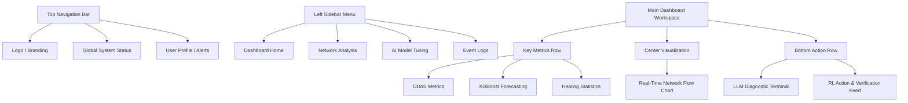

# HealX Bot - Dashboard Wireframe Diagram

This document provides a simple, structural wireframe diagram of the HealX Bot Dashboard.

## 1. Text-Based UI Wireframe (Layout)

```text
+---------------------------------------------------------------------------------------------+
|  [🛡️] HEALX BOT          [🟢 System Status: OPERATIONAL ]             [👤 Admin Operative]  |
+---------------------------------------------------------------------------------------------+
|                 |                                                                           |
|  NAVIGATION     |  +---------------------+ +---------------------+ +---------------------+  |
|  > Dashboard    |  | DDoS Neural Net     | | XGBoost Forecast    | | Autonomous Healing  |  |
|  > Network IP   |  | Threat Blocked: 1402| | Next Failure: 4.2h  | | Success Rate: 98%   |  |
|  > AI Models    |  | Confidence: 94.2%   | | Target: JVM-Billing | | Actions Today: 12   |  |
|  > Event Logs   |  +---------------------+ +---------------------+ +---------------------+  |
|  > Settings     |                                                                           |
|                 |  +-------------------------------------------------------------------+    |
|                 |  | Live Network Traffic & DDoS Threat Classification Panel           |    |
|                 |  |                                                                   |    |
|                 |  |   |||    |||||||     |||||        |||||||||||||     ||||||        |    |
|                 |  |   |||    |||||||     |||||        |||||||||||||     ||||||        |    |
|                 |  |  Benign  Benign  [CRITICAL: UDP]     Benign         Benign        |    |
|                 |  |                   (Action: Block)                                 |    |
|                 |  +-------------------------------------------------------------------+    |
|                 |                                                                           |
|                 |  +-----------------------------------+ +-----------------------------+    |
|                 |  | LLM Root Cause Analyzer Terminal  | | Execution & RL Reward Feed  |    |
|                 |  |                                   | |                             |    |
|                 |  | > Fault: container_crash          | | [10:02] Block IP (Reward +1)|    |
|                 |  | > Logs: Ulimit open files maxed   | | [09:45] Nginx restarted (+1)|    |
|                 |  | > LLM Diag: File descriptor leak  | | [09:12] Killed PID 4592     |    |
|                 |  | > Action: Executing docker restart| |                             |    |
|                 |  |-----------------------------------| |                             |    |
|                 |  | Awaiting verification...          | | View Full Audit Log ->      |    |
|                 |  +-----------------------------------+ +-----------------------------+    |
+---------------------------------------------------------------------------------------------+
```

---

## 2. Component Structure (Mermaid Block Diagram)


